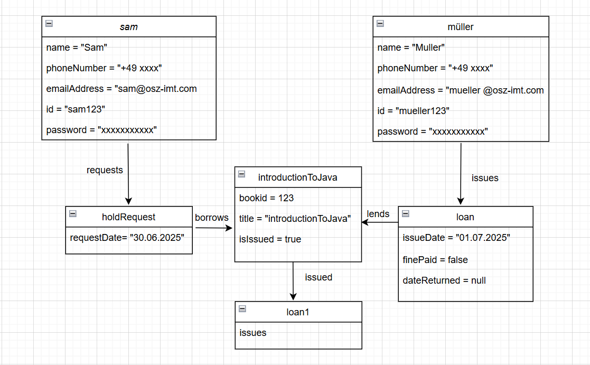
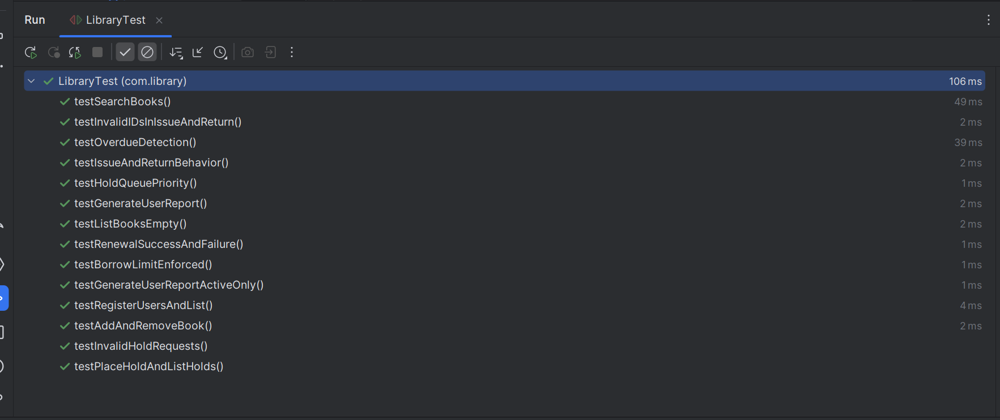

## Library Management System - Project Plan
### Project Overview
- A terminal-based Library Management System that demonstrates core OOP principles through managing books, users and borrowing operations.

### Project Goals
- Showcase inheritance, polymorphism, encapsulation, and abstraction in a realistic domain.
- Provide a clean, menu‑driven CLI suitable for OSZ‑IMT coursework and small demos.
- Keep the codebase modular so new features (fines, persistence, REST API) can be layered in later.

### Core Use‑Cases

#### Area / Features
- CLI Commands
- Book Management
- add • remove • edit • search • list all
- Borrower & Staff Management
- register borrower • register staff (clerk / librarian) • list
- Hold Queue
- place hold • cancel hold • list holds per book
- issue (checkout) • renew • return
- Reports
- overdue loans • borrower history • popular titles
- Class Model (matches UML diagram)

### Applying OOP
#### Object diagram

#### Class diagram

#### Applied OOP Principles
##### Inheritance
- Person → Borrower, Staff; Staff → Clerk, Librarian; Book → TextBook, Novel, Reference

##### Polymorphism
- different loan limits (Borrower vs Staff), different loan periods (TextBook 14‑day / Novel 21‑day / Reference 7‑day)

##### Encapsulation
- private fields + getters/setters; validation inside constructors and setters

##### Abstraction
- Person, Book, and Staff declared abstract; Borrowable interface (future)

### Class Structure

#### Core Classes

Person (abstract)— id, name, email, phone printInfo()

Borrower — extra collections List<Loan> loans, List<HoldRequest> holds; getMaxBorrowLimit() = 3

Staff (abstract) — salary, issuing authority

Clerk — deskNo

Librarian — officeNo; broader privileges

Book (abstract) — bookId, title, author, subject, isIssued; getLoanPeriod(), getBookType()

TextBook (14‑day) — subject, edition

Novel (21‑day) — genre, pages

Reference (7‑day, in‑house) — volume, edition

HoldRequest— requestDate, refs to Borrower & Book

Loan — issuedDate, dueDate, dateReturned, finePaid, refs to Borrower, Book, and issuing Staff

Library — façade/service holding all collections and orchestrating operations

LibrarySystem — CLI menu driver

#### Key Methods (selected)

- Library
addBook(), removeBook(), searchBooks(), registerUser(), placeHold(), issueBook(), returnBook(), renewLoan(), displayOverdue(), generateUserReport()

- Borrower / Staff
getMaxBorrowLimit(), printInfo(), canBorrow()

- Book
getLoanPeriod(), issue(), placeOnHold(), returnBook()

- Loan
isOverdue(), calculateFine(), renew()

### Data Structure
- HashMap<String,Book> — book catalogue (key=ISBN/bookId)
- HashMap<String,Person> — user registry (key=userId)
- ArrayList<HoldRequest> — global & per‑book hold queues
- ArrayList<Loan> — active & historical loan records

### Menu Structure

(a) Book Management

1.1 Add Book 1.2 Remove Book 1.3 Search Books 1.4 Display All Books

(b) User Management

2.1 Register Borrower 2.2 Register Staff (Clerk/Librarian) 2.3 Display All Users

(c) Hold Operations

3.1 Place Hold 3.2 Cancel Hold 3.3 List Holds for Book

(d) Borrowing Operations

4.1 Issue Book 4.2 Renew Loan 4.3 Return Book 4.4 Display Overdue Loans

(e) Reports

5.1 Borrower History 5.2 Popular Books 5.3 Library Statistics

(f) Exit

### Testing

#### Manual testing
Pre‑populate a mix of TextBook, Novel, Reference records
Add at least one Borrower, one Clerk, one Librarian
Seed a loan and a hold request to validate overdue and queue logic

#### Automated testing (unittest result)

