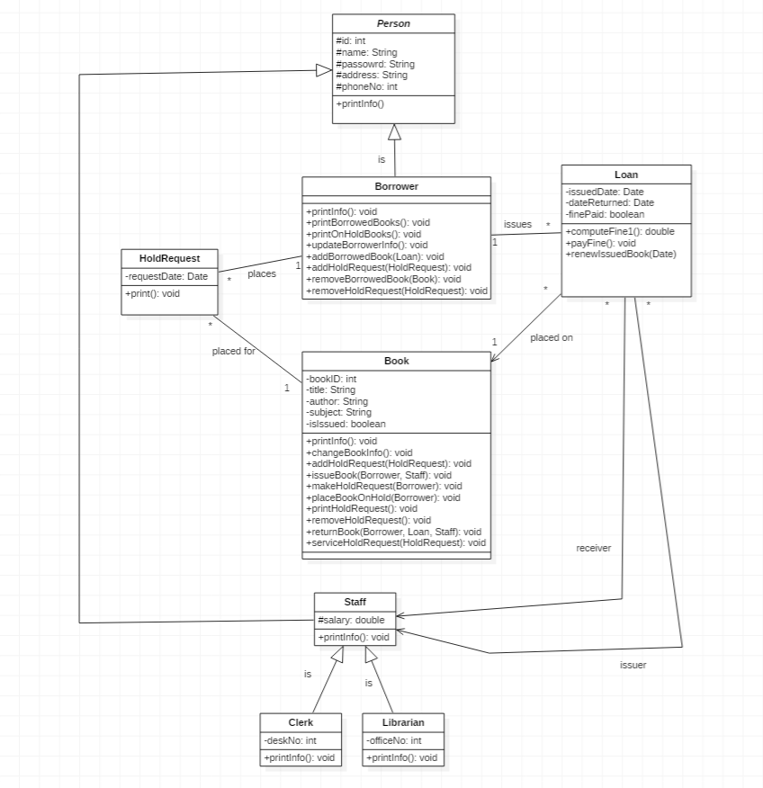

## Library Management System - Project Plan
### Project Overview
- A terminal-based Library Management System that demonstrates core OOP principles through managing books, users and borrowing operations.

#### Interface

### Project Goals
- Showcase inheritance, polymorphism, encapsulation, and abstraction in a realistic domain.
- Provide a clean, menu‑driven CLI suitable for OSZ‑IMT coursework and small demos.
- Keep the codebase modular so new features (fines, persistence, REST API) can be layered in later.

### Core Use‑Cases

#### Area / Features
- CLI Commands
- Book Management
- add • remove • edit • search • list all
- Borrower & Staff Management
- register borrower • register staff (clerk / librarian) • list
- Hold Queue
- place hold • cancel hold • list holds per book
- issue (checkout) • renew • return
- Reports
- overdue loans • borrower history • popular titles
- Class Model (matches UML diagram)

### Applying OOP
#### Object diagram

#### Class diagram

#### Applied OOP Principles
##### Inheritance
- Person → Borrower, Staff; Staff → Librarian; Book → TextBook, Novel, Reference

##### Polymorphism
- different loan limits (Borrower vs Staff), different loan periods (TextBook 14‑day / Novel 21‑day / Reference 7‑day)

##### Encapsulation
- private fields + getters/setters; validation inside constructors and setters

##### Abstraction
- Person, Book, and Staff declared abstract; Borrowable interface (future)

### Class Structure

#### Core Classes

- **Person** (abstract)  
  Fields: `id`, `name`, `email`, `phone`  
  Methods: `printInfo()`, `getMaxBorrowLimit()` (abstract)

- **Borrower** (extends `Person`)  
  Fields:  
  └─ `List<Loan> loans` (active & past)  
  └─ `List<HoldRequest> holds` (pending)  
  Methods:  
  └─ `getMaxBorrowLimit()` → 3  
  └─ inherits `printInfo()`

- **Librarian** (extends `Person`)  
  Methods:  
  └─ `getMaxBorrowLimit()` → 10  
  └─ inherits `printInfo()`

- **Book** (abstract)  
  Fields: `bookId`, `title`, `author`, `subject`, `isIssued`  
  Methods:  
  └─ `getLoanPeriod()` (abstract)  
  └─ `issue(Loan)`, `returned()`  
  └─ `printInfo()`

- **TextBook** (extends `Book`)  
  Overrides `getLoanPeriod()` → 14 days

- **Novel** (extends `Book`)  
  Overrides `getLoanPeriod()` → 21 days

- **Reference** (extends `Book`)  
  Overrides `getLoanPeriod()` → 7 days

- **HoldRequest**  
  Fields: `requestDate`, reference to `Borrower` & `Book`  
  Methods: getters

- **Loan**  
  Fields: `issueDate`, `dueDate`, `returnDate`, reference to `Borrower`, `Book`, `Librarian`  
  Methods:  
  └─ `isOverdue()`  
  └─ `renew()` (extends **current** dueDate by loan period)  
  └─ `close()` (marks returned)  
  └─ `printInfo()`

- **Library**  
  *Service façade* holding all collections (`Map<String,Book>`, `Map<String,Person>`, `List<HoldRequest>`, `List<Loan>`) and orchestrating operations.

- **LibrarySystem**  
  *CLI driver* reading user input and invoking `Library` methods.

#### Key Methods

- Library
addBook(), removeBook(), searchBooks(), registerUser(), placeHold(), issueBook(), returnBook(), renewLoan(), displayOverdue(), generateUserReport()

- Borrower / Staff
getMaxBorrowLimit(), printInfo(), canBorrow()

- Book
getLoanPeriod(), issue(), placeOnHold(), returnBook()

- Loan
isOverdue(), printInfo(), renew()

### Data Structure
- HashMap<String,Book> — book catalogue (key=ISBN/bookId)
- HashMap<String,Person> — user registry (key=userId)
- ArrayList<HoldRequest> — global & per‑book hold queues
- ArrayList<Loan> — active & historical loan records

### Menu Structure

(a) Book Management

1.1 Add Book 1.2 Remove Book 1.3 Search Books 1.4 Display All Books

(b) User Management

2.1 Register Borrower 2.2 Register Staff (Librarian) 2.3 Display All Users

(c) Hold Operations

3.1 Place Hold 3.2 List Holds for Book

(d) Borrowing Operations

4.1 Issue Book 4.2 Renew Loan 4.3 Return Book 4.4 Display Overdue Loans

(e) Reports

5.1 Borrower History

(f) Exit

### Testing

#### Automated testing (unittest result)

#### Manual testing
- Simply run the `Main` class
- As seen in the interface image on the top of this file, make a choice

###### Add Book

Enter 1
- Title: “My Test”
- Author: “Sam”
- Subject: “Demo”
- Choose type (1/2/3): 2
- → “✅ Book: My Test with ID: BK-004 added successfully”

###### Remove Book

- Enter 2
- Book ID: BK-004
- → “✅ Book: My Test is removed”

###### Search Books

Enter 3
- Keyword: Java
- → Lists all books whose title, author or ID matches “Java”.

###### Display All Books

- Enter 4
- → Prints every catalog entry (or you get an info; no books if empty).

###### Register Borrower

- Enter 5
- Name: “Samuel”
- Email: “samuel@oszt-imt.com”
- Phone: “12345678553”
- → “✅ Borrower Samuel registered with ID BOR-0004”

###### Register Librarian

- Enter 6
- Name: “Bob”
- Email: “bob@gmail.com”
- Phone: “12345678551”
- → “✅ Librarian Bob registered with ID LIB-0004”

###### Display All Users

- Enter 7
- → Lists all borrowers (BOR-xxxx) and librarians (LIB-xxxx).

###### Place Hold

- First issue a book: do steps 10 then return to menu.
- Enter 8
- Borrower ID: BOR-0001
- Book ID: BK-001
- → “✅ Hold placed for book ID : BK-001”
- If you try on an available book, you get ❌…only issued books may be held.

###### List Holds for Book

- Enter 9
- Book ID: BK-001
- → Shows each hold: “ • Sam – 2025-07-05” or an info if none.

###### Issue Book

- Enter 10
- Borrower ID: BOR-0001
- Book ID: BK-001
- Librarian ID: LIB-0001
- → “✅ Issued book with ID : BK-001 to User with ID : BOR-0001”
- If you re-issue an already issued book, you’ll see ❌…already issued.

###### Renew Loan

- Enter 11
- Borrower ID: BOR-0001
- Book ID: BK-001
- → “✅ Loan renewed! New due date: 2025-07-19” (for a non-overdue loan)
- If the loan is overdue, you get ❌ Cannot renew—loan … is already overdue.

###### Return Book

- Enter 12
- Book ID: BK-001
- → “✅ Returned”
- If you try to return it again you see ❌ Failed.

###### Overdue Loans

- Enter 13
- → Lists all loans whose due-date < today, or an info says; There are no overdue loans.

###### Borrower History

- Enter 14
- Borrower ID: e.g. BOR-0001
- → If they have past & active loans, you see each; if none, you get an info; Borrower … has not borrowed any books yet.
- → If the ID doesn’t exist: ❌ No user found with ID: …

###### Exit

- Enter 0
- → “Good-bye” and the program terminates.